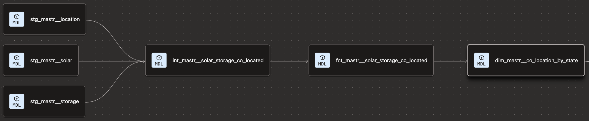

# ⚡ German MaStR Energy Pipeline: Co-Located Solar & Storage Analytics


An end-to-end modular data analytics platform transforming raw data from Germany's Marktstammdatenregister (MaStR) into business-ready insights. The ecosystem combines a custom high-performance Python streaming ELT pipeline for raw XML ingestion with a 3-layer dbt architecture in Google BigQuery to analyze co-located Solar PV and Battery Storage assets across German federal states.

---

## 🎯 Business Context & Purpose

Germany's rapid expansion of renewable energy requires grid stabilization. Co-locating battery storage with solar PV mitigates generation curtailment and shifts peak solar supply to high-demand hours. 

This project answers critical energy market questions:
* Which German states lead in co-located solar + storage deployment?
* What is the average storage-to-solar capacity ratio across regions?
* Are batteries deployed concurrently with solar installations, or retrofitted later?

---

## 🔗 Upstream Ingestion Pipeline (ELT)

Before dbt transforms the data, raw MaStR XML archives are ingested into Google BigQuery using a custom streaming Python pipeline:

👉 **[MaStR-Data-Pipeline Repository](https://github.com/arlo-r/MaStR-Data-Pipeline)**

### Key Highlights:
* **Memory-Efficient XML Streaming**: Uses Python 3.14+, `uv`, `lxml` (`iterparse`), and `Polars` to stream-parse multi-gigabyte XML files into compressed Parquet files without RAM exhaustion.
* **Smart BigQuery Sync**: Automates row-count verification between local Parquet datasets and BigQuery `mastr_raw` tables to bypass redundant uploads.

---

## 🏗️ End-to-End Data Architecture

The project adheres to dbt best practices using a standard 3-layer architecture:

```text
 ┌───────────────────────────┐
 │   German MaStR Registry   │ (Raw XML Downloads)
 └─────────────┬─────────────┘
               │
               ▼
 ┌───────────────────────────┐
 │   MaStR Data Pipeline     │ 
 │ (Streaming XML ➔ Parquet) │  * Stream-parses XML with lxml iterparse & Polars
 └─────────────┬─────────────┘  * Smart syncs Parquet files to BigQuery mastr_raw
               │
               ▼
 ┌────────────────────────────┐
 │ Google BigQuery (mastr_raw)│
 └─────────────┬──────────────┘
               │
               ▼
 ┌───────────────────────────┐
 │ dbt Transformation Layer  │
 │  * Staging (stg_mastr__)  │  * Cleans, casts types, standardizes state codes
 │  * Inter. (int_mastr__)   │  * INNER JOINs Solar & Storage on location_mastr_id
 │  * Analytics Marts        │  * Aggregates state-level flexibility metrics
 └───────────────────────────┘
```
## Key Technical Decisions
- **DRY Principles**: Encapsulated catalog mappings (e.g., German federal state codes to names) into reusable Jinja `macros` (`map_german_state`).

- **Data Quality**: Comprehensive dbt data tests (`not_null`, `unique`, `accepted_values`) enforced at all layers.

- **Join Logic Strategy**: Utilized `INNER JOIN` between Solar and Storage to rigorously isolate co-located assets, paired with a `LEFT JOIN` on Location metadata to eliminate unwanted data loss.

## 📊 Data Lineage Graph
Below is the dbt lineage DAG illustrating data transformation flow from raw sources to aggregate analytics marts:


## 📈 Key Market Insights (Sample Output)
Aggregated analytics from `dim_mastr__co_location_by_state`:
| State Name | Co-Located Sites | Total Solar (kW) | Total Storage (kW) | Avg Capacity Ratio | Storage Added After Solar % |
| :--- | :--- | :--- | :--- | :--- | :--- |
| Nordrhein-Westfalen | ~410,300 | 3,718,326 | 2,532,841 | 1.20 | ~98% |
| Bayern | ~405,900 | 4,493,215 | 2,943,997 | 1.17 | ~96% |
| Niedersachsen | ~280,900 | 2,969,585 | 1,940,743 | 1.50 | ~97% |

## ⚙️ How to Run & Test
### Prerequisites
- Python 3.9+
- `dbt-bigquery` installed
- Access to Google BigQuery project with MaStR raw dataset

### Installation & Execution
1. **Clone repository**:

```
git clone https://github.com/arlo-r/german-mastr-energy-pipeline
cd dbt-mastr-energy
```
2. Verify connection:

```
dbt debug
```
3. Build models and run tests:
```
dbt build
```
4. Generate documentation & lineage:

```
dbt docs generate
dbt docs serve
```